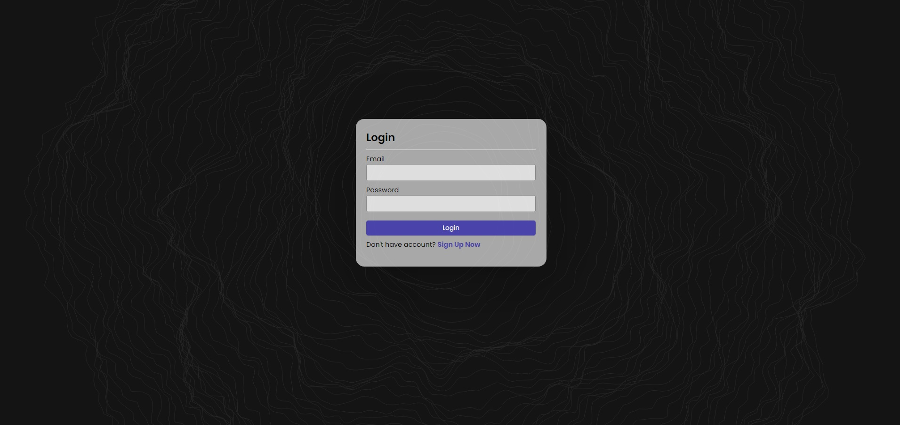
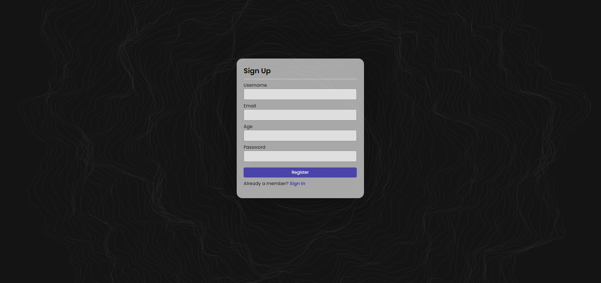
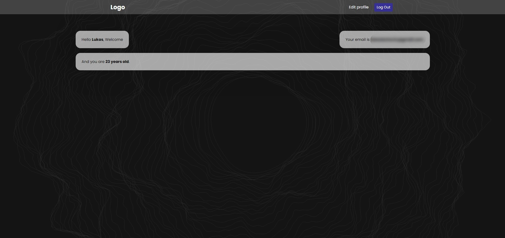
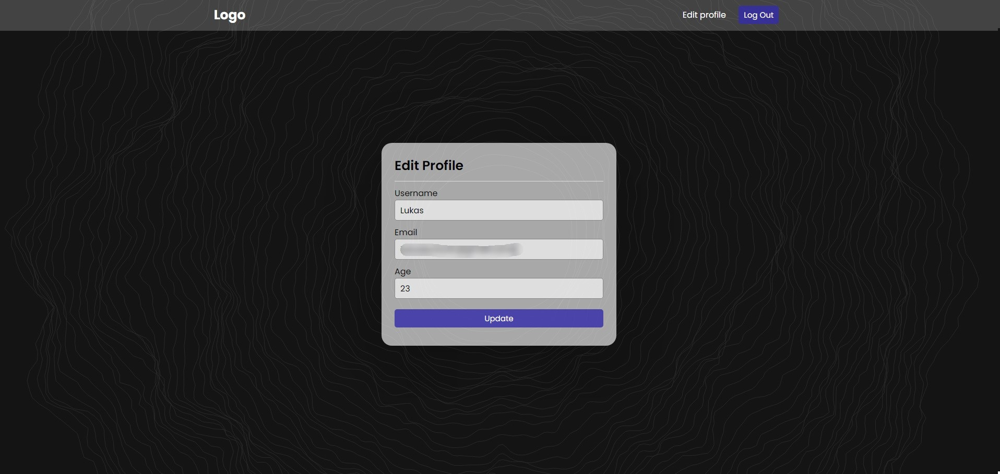

# Login and Registration System

This repository contains the code for a simple login and registration system built using PHP, HTML, CSS, and JavaScript. It provides basic functionalities like user authentication, registration, and profile editing.

## Features

- **User Authentication**: Users can log in securely with their email and password.
- **Registration**: New users can register by providing a username, email, age, and password.
- **Profile Editing**: Logged-in users can edit their profile details including username, email, and age.
- **Session Management**: Sessions are used to keep users logged in across different pages.

## Technologies Used

- **Frontend**: HTML, CSS (with Google Fonts), JavaScript
- **Backend**: PHP
- **Database**: MySQL (included in this repository)
- **External Libraries**: Font Awesome for icons, Vanta.js for the live background effect

## Setup Instructions

1. Clone the repository to your local machine.
2. Configure the `php/config.php` file with your MySQL database credentials.
3. Import the provided SQL file into your MySQL database to create the necessary tables.
4. Make sure your web server supports PHP.
5. Navigate to the project directory in your terminal and start your local server.
6. Visit `index.php` in your web browser to access the login and registration pages.

## Screenshots

